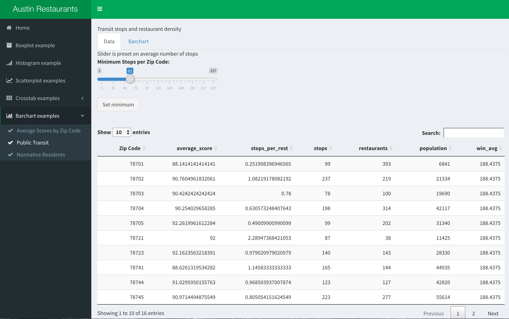

#**Introduction**
 In this project, we're examining inspection scores for restaurants in and around Austin, Texas, from 2014 through early 2017.  Scores are determined through routine inspections, usually conducted twice a year.  If a score lower than 70 is recorded in a yearly inspection, the restaurant will be subjected to one or more followup visits to ensure a return to compliance.  All of our restaurant inspection records include geographical information in the form of zip codes, allowing the use of additional datasets to further explore the data.  Visit https://data.world/kvaughn/s-17-dv-project-6 to explore our datasets, or see below for the visualizations we've made of the data.

##**R Configuration**
Below we display our sessionInfo().

```{r SessionInfo, echo=FALSE} 
sessionInfo(package=NULL)
```

#**The Data**
The restaurant inspection dataset was provided through the City of Austin's Open Data Portal, https://data.austintexas.gov/.  This free download is available in multiple formats at https://data.austintexas.gov/Health/Restaurant-Inspection-Scores/uthw-a7ih.  For this project, we downloaded a CSV file and cleaned it using the Extract-Translate-Load procedure outlined below.

#**Extract-Translate-Load (ETL)**
The dataset we received needed some cleaning, as it was unreadable to Tableau in its original CSV formatting.  We used the Extract-Translate-Load method discussed in class, and built an R script found at "../01 Data/ETLRestaurant.R"  We also cleaned up the join query used in our Tableau visualizations; it can be found at "../01 Data/ETLQuery.R"  If you'd like to follow along, here's how we processed the restaurant inspection data:

##*Step-By-Step Instructions*
**First, download the uncleaned CSV: https://data.austintexas.gov/api/views/ecmv-9xxi/rows.csv?accessType=DOWNLOAD. Prepend "PreETL_" to the file name, and put it in a folder called CSVs in the same directory as this project (s17dvproject5-vaughn-cannata-martinez).**

###*Step 1: Set up the environment*
Note that we have one column of numeric data ("Score"), one column of dates ("Inspection Date"), three columns of strings ("Restaurant Name", "Address", and "Process Description"), and two columns of numeric data used categorically ("Zip Code" and "Facility ID").  For the sake of ease of use, these last two columns will be treated as strings.
```{r etl1}
# Set working directory
setwd("~/s17dvfinalproject-vaughn-cannata-martinez-1/00 Docs")

# Set filepath
file_path = "../../CSVs/PreETL_Restaurant_Inspection_Scores.csv"

# Create dataframe from original CSV
df <- read.csv(file_path, stringsAsFactors = FALSE)

# Standardize column names
names(df) <- gsub("\\.+", " ", names(df))

# Print column names and types
str(df)
```

###*Step 2: Collect columns by type*
We've grouped the date column separately from measures and dimensions; while Tableau will recognize these data as dates, it seems prudent to reclassify them into a standardized format.
```{r etl2}
# Select string data as 'dimensions'
dimensions <- c("Restaurant Name", "Zip Code", "Address", "Process Description", "Facility ID")

# Select dates as 'dates'
dates <- c("Inspection Date")

# Select all remaining data as 'measures'
measures <- setdiff(names(df), union(dimensions, dates))

```

###*Step 3: Remove special characters*
Here we remove special characters from all of our data.  These characters can serve no purpose in the data, and might cause problems in the analysis process.  To improve readability, special characters have been replaced by spaces.
```{r etl3}
# Get rid of special characters in each column.
for(n in names(df)) {
  df[n] <- data.frame(lapply(df[n], gsub, pattern="[^ -~]",replacement= " "), stringsAsFactors = FALSE)
}
```

###*Step 4: Modify records in dimensions*
Now we go through all of the character-based columns (grouped as dimensions) and remove troublesome characters.  Ampersands are replaced with "and", semicolons are replaced with colons, and single- and double-quotes are removed outright.  Data of NA (null) is replaced with an empty string.
```{r etl4}
# This function will replace NA data with an empty string
na2emptyString <- function (x) {
  x[is.na(x)] <- ""
  return(x)
}
# We'll apply this to all columns grouped as dimensions
if( length(dimensions) > 0) {
  for(d in dimensions) {
    # Change NA to the empty string.
    df[d] <- data.frame(lapply(df[d], na2emptyString), stringsAsFactors = FALSE)
    # Get rid of " and ' in dimensions.
    df[d] <- data.frame(lapply(df[d], gsub, pattern="[\"']",replacement= ""), stringsAsFactors = FALSE)
    # Change & to and in dimensions.
    df[d] <- data.frame(lapply(df[d], gsub, pattern="&",replacement= " and "), stringsAsFactors = FALSE)
    # Change : to ; in dimensions.
    df[d] <- data.frame(lapply(df[d], gsub, pattern=":",replacement= ";"), stringsAsFactors = FALSE)
  }
}

```

###*Step 5: Modify dates*
Here we ensure that dates are formatted correctly.
```{r etl5}
if( length(dates) > 1 || ! is.na(dates)) {
  for(y in dates) {
    # Format as dates
    df[y] <- data.frame(lapply(df[y], function(y) as.Date(y, format = "%m/%d/%y")), stringsAsFactors = FALSE)
  }
}
```

###*Step 6: Modify measures*
Now we take all of the non-numeric characters out of our measures.
```{r etl6}
na2zero <- function (x) {
  x[is.na(x)] <- 0
  return(x)
}
# Get rid of all characters in measures except for numbers, the - sign, and period.dimensions, and change NA to 0.
if(length(measures) > 1 || ! is.na(measures)) {
  for(m in measures) {
    df[m] <- data.frame(lapply(df[m], gsub, pattern="[^--.0-9]",replacement=""), stringsAsFactors = FALSE)
    df[m] <- data.frame(lapply(df[m], na2zero), stringsAsFactors = FALSE)
    df[m] <- data.frame(lapply(df[m], function(m) as.numeric(as.character(m)))) # This is needed to turn measures back to numeric because gsub turns them into strings.
  }
}
```

###*Step 7: Dummy check*
Always a useful thing.  Let's look at our data and see what we've got.  We're expecting all data to be in character form except "Score", which will be numeric, and our date column named "Inspection Date".
```{r etl7}
# Take a look and make sure it's what you think it should be:
print(summary(df))
```

###*Step 8: Write to a new file*
Our data looks good, and we need to write it to a new file.
```{r etl8}
# Now write it to a new clean file.
write.csv(df, gsub("PreETL_", "", file_path), row.names=FALSE, na = "")
```

#**Visualizations**

##**Crosstab-related Visualizations using Tableau**
Below you will find the visualizations we created using Tableau. Each visualization is only a fraction of the information that can be viewed in Tableau, as these crosstabs cannot showcase all the information available at once.  Our Tableau workbook is included in our repository in the folder 01 Data.

###*Inspection Scores, Area, and Income*
This crosstab shows by year and zipcode (in Austin), the average restaurant inspection score. The crosstab is colored by the percentage of households in each area under the national poverty line (pulled from US Census data). As is evident, average scores remain relatively high across poverty levels and zipcodes. In Tableau you are able to cycle through zipcodes in the western or eastern half of the greater Austin area. Even at this level, average scores remain similar. There are more average scores below 90 in the eastern section, but this is likely not significant.

<center></center>

It is possible this is unique to Austin, and may be a consequence of stringent food safety code in these areas. Further analysis would need to be done to see if these correlations are true elsewhere in the United States.

###*Average Inspection Scores Geographically*
As can be seen, this visualization displays the average inspections score for each zipcode area. Each zipcode's color is determined by its average inspection score's proximity to the grand average for the year(s) selected in the filter.  This is done using a calculated field, and will be recalculated according the the data selected in the Year filter.  If arriving at this map by clicking on either of the crosstabs, the zip codes will display the difference from the grand average of the selected year.

<center></center>

It is again evident that average scores are relatively high across each area. 

###*Average Score by Year*
This highly comprehensive visualization shows us three main pieces of information: average score, minimum score, and safety index. As has been previously noted, average scores are relatively high in each zipcode. Minumum scores can be quite low (one of the lowest scores is 36), but these are few and far between.

<center></center>

This crosstab is also colored by a Safety Index.  This KPI is based in a calculated field that accounts for the average score and minimum score for a given zip code in a given year, then parameterized into Low, Medium, and High rankings.  The break point for each of these groupings can be adjusted using the sliders to the right of the crosstab.  

##**Barchart-related Visualizations using Tableau**


###*CapMetro Stops by Zipcode as they Relate to Restaurant Density*
Here we see visualized the number of bus stops per zipcode, colored by the number of restaurants in that zipcode. This visualization also shows an average line for the average number of stops. As is evident, the zipcodes with the darkest bars (those with the highest restuarant density), almost always surpass the average line, but also generally greatly surpass it. This is interesting because it suggests that, in general, zipcodes with a higher than average number of bus stops also have a high restuarant density.

<center></center>
<center></center>

In Tableau, this visualization also allows you to adjust which zipcodes are displayed based on a minimum amount of restaurants, and also based on whether the zipcodes are above or below this minimum.

###*Foreign Population vs. Restaurant Density*
Here we find a visualization that showcases foreign population by zipcode, and is colored to reflect the restaurant density of each zipcode. In Tableau, you are also able to toggle back and forth between a higher than average, or an at/below average foreign population.

<center></center>
<center></center>

From this barchart, it would seem that higher than average foreign populated zipcodes don't necessarily have a higher restaurant density. Overall, it appears that restaurant density is pretty even across levels of foreign-born population (i.e. there are relatively similar numbers of high restaurant density zipcodes in both categories). This is interesting because it suggests that restaurant density may be fairly independent of foreign- or native-born population status.

###*Stop to Restuarant Ratios per Zipcode by Nativity*
This visualization shows the populations of Native, Naturalized, and Non-Cititzen inhabitants for each zipcode. Further, these barcharts are colored by the restaurant to stop ratio (darker purple indicates a higher ratio). The highest ratios are between 78721 and 78724. 

<center></center>

Interestingly, the population of native, naturalized, and non-citizen peoples is quite variable across zipcodes. Another interesting point is that for all three categories, the highest ratios are not correlated with the highest populations. This, of course, seems non-intuitive, and may be an area for future inquiry.

##**Visualizations using Shiny in R**
The screenshots and descriptions below are based on our interactive visualization app, accessible at https://kvaughn.shinyapps.io/restaurant_inspection/.

###**Boxplot Visualization using Shiny in R**
One low score does not indicate a systemic problem with a restaurant's cleanliness; before judging a restaurant with a low score, it behooves us to consider the other scores it has received.  This boxplot allows the user to do just that.  First select a cutoof point for scores, then choose a zipcode to see all restaurants that have scored below that level at least one.  Each restaurant's scores will display, giving the user an idea of whether the low score was a fluke or a sign of problems.

###**Histogram Visualization using Shiny in R**

###**Scatterplot Visualization using Shiny in R**


###**Crosstab Visualizations using Shiny in R**
Click here to be taken to our published Shiny app: https://kvaughn.shinyapps.io/restaurant_inspection/

###*Safety Index*
This visualization starts with a somewhat-arbitrary KPI, the "Safety Index," that takes into account both the average score and the lowest inspection score received for a given zip code in a given year.  A high Safety Index indicates both a high average score and a high minimum score.  Set the parameters however you like (3 and 8 are reasonable defaults) and check the crosstab to see each zip code's ratings over the four-year period.

<center></center> 
<center></center>

###*Lowest Inspection Scores*
This visualization allows the user to set an arbitrary cutoff point as an aid for identifying low inspection scores.  The default value, 70, is the cutoff for restaurant inspections; lower scores will trigger a reinspection.  After selecting a parameter using the slider and requesting data, the user can select the "Crosstab" tab to see which zip codes and years had unacceptably low inspection scores.

<center></center> 
<center></center>

###*People per Restaurant*
Austin is a fast-growing city, and our restaurant scene is currently booming as well.  This visualization allows a user to see where the density of restaurants compared to population is highest.  Using a public population dataset generated by the US Census, we can find the number of people per restaurant in a given zip code; as more restaurants are added (or fail), the people-per-restaurant number changes.  The default values highlight the density of restaurants in 78701, which is downtown Austin.

<center></center> 
<center></center>

##**Barchart Visualizations using Shiny in R**
These visualizations are also accessible at https://kvaughn.shinyapps.io/restaurant_inspection/

###*Scores by Zip Code*
Barcharts can be a good way to quickly identify trends visually.  In this visualization, the user can create a set of zip codes of interest, then see each zipcode's average score per year over the three or four years contained in the dataset.

<center></center> 
<center></center>

###*Transit stops and restaurant density*
Capital Metro, the Austin-area transit service, has made its data freely available for public download.  By importing this data into geographic information software (ArcGIS) and overlaying the coordinates of transit stops on a shapefile of regional zip codes, we were able to count the number of transit stops per zip code.  In this bar chart, we're examining the relationship between transit density and restaurant density.  Use the slider to select zip codes with more than the minimum number of transit stops, then compare the number of restaurants in these zip codes to the average number of restaurants per zip code throughout the region.  The blue line is the calculated average for all of the selected zip codes, and the red is the grand average for all of the zipcodes in the Greater Austin area.

<center></center> 
<center></center>

###*Nonnative residents and restaurant density*
Would we expect zip codes with comparatively large numbers of nonnative (naturalized-citizen or noncitizen) residents to have more or fewer restaurants, on average, than zip codes with lower percentages of nonnative residents?  This barchart allows the user to select a minimum percentage of nonnative residents per zip code, then shows the number of restaurants in that zip code and the average number of restaurants per zip code for all of the qualifying zip codes.  This average can be compared to the grand average throughout the greater Austin area, shown in red.

<center></center> 
<center></center>
